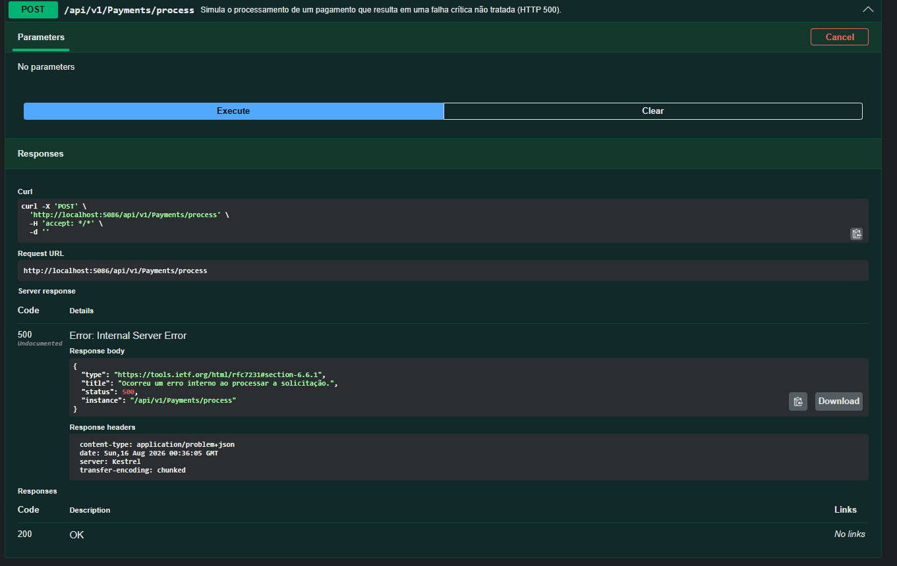
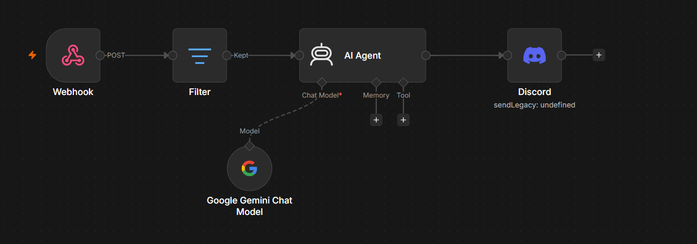
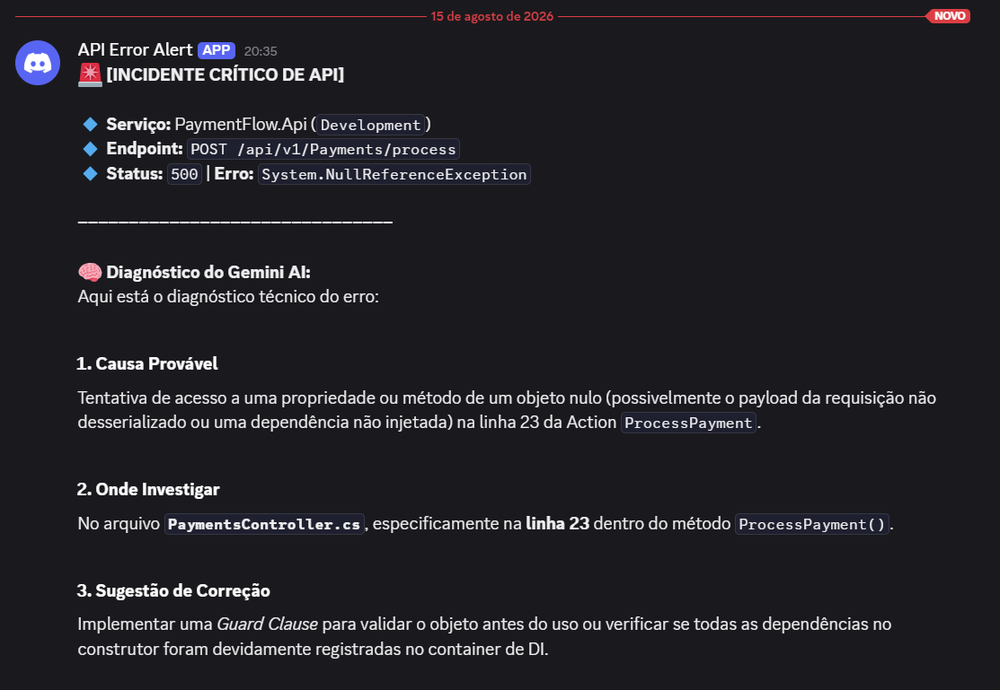
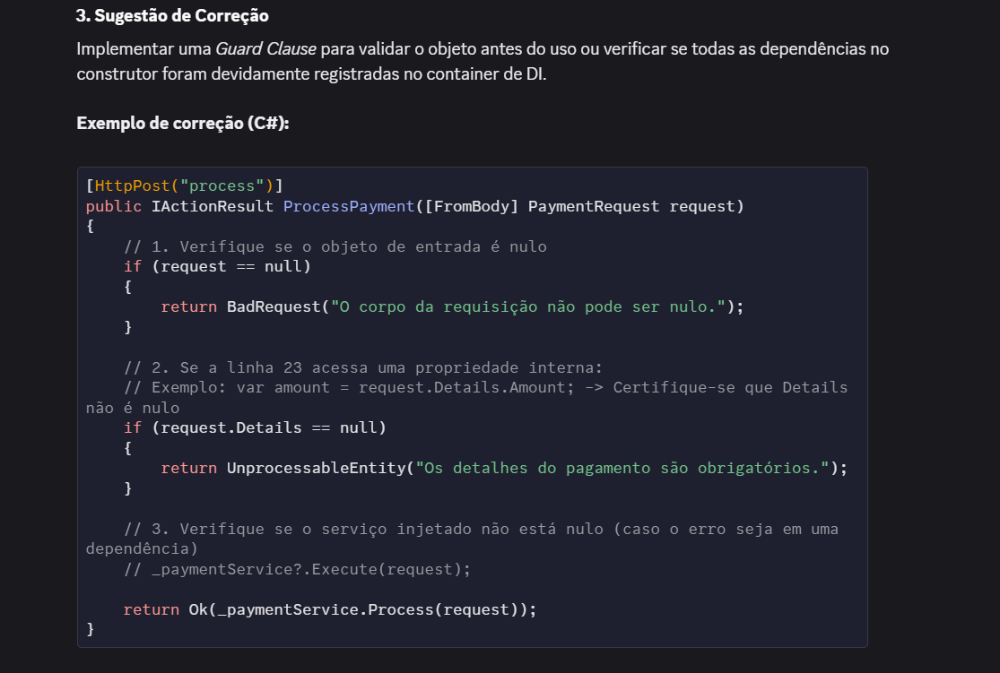
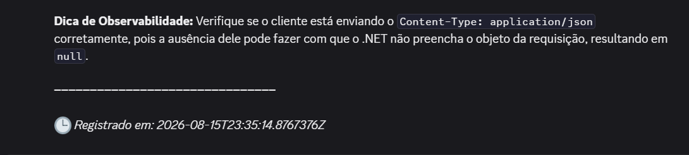

# 🛡️ API Sentinel — Observabilidade e Diagnóstico Inteligente de Falhas


## 🎯 Objetivo e Proposta de Valor

### O problema

Em ambientes corporativos baseados em microsserviços, falhas críticas podem gerar grandes volumes de logs e aumentar o tempo necessário para diagnóstico e resolução de incidentes (*Mean Time to Resolution — MTTR*).

Além disso, processos de registro e notificação executados diretamente no fluxo principal da requisição podem adicionar latência desnecessária à aplicação.

### A solução

O **API Sentinel** implementa um ecossistema de observabilidade e diagnóstico de falhas.

A aplicação:

* Padroniza respostas de erro utilizando a especificação **RFC 7807 — Problem Details**.
* Intercepta exceções de forma centralizada através de middleware.
* Envia o contexto do erro de forma assíncrona utilizando o padrão *Fire-and-Forget*.
* Encaminha os dados para um fluxo automatizado no **n8n**.
* Utiliza o **Google Gemini** para analisar o erro e gerar um diagnóstico técnico.
* Envia o resultado do diagnóstico para um canal técnico do **Discord**.

### 🤖 Diagnóstico com IA

O fluxo de automação recebe informações como:

* Nome do serviço
* Timestamp
* Tipo da exceção
* Mensagem de erro
* Stack trace

O **Google Gemini** analisa esse contexto e produz um diagnóstico contendo a provável causa raiz, recomendações de mitigação e sugestões de correção.

---

## 🛠️ Tecnologias Utilizadas

* **Runtime & Linguagem:** .NET 10 e C# 13
* **Framework Web:** ASP.NET Core
* **Documentação:** OpenAPI / Swagger
* **Resiliência & Observabilidade:**

  * ASP.NET Core Middleware
  * RFC 7807 — Problem Details
  * `IHttpClientFactory`
  * Comunicação assíncrona *Fire-and-Forget*
* **Conteinerização:** Docker e Docker Compose
* **Orquestração:** n8n
* **Inteligência Artificial:** Google Gemini
* **Comunicação:** Discord Webhooks

---

## 🏗️ Domínio da API e Arquitetura Modular

A aplicação simula o backend de um **Gateway de Pagamentos**, representado pelo projeto `PaymentFlow.Api`.

O cenário foi escolhido por representar um domínio no qual falhas de infraestrutura exigem rastreabilidade e diagnóstico rápidos.

### Por que a divisão em dois projetos?

A solução foi estruturada buscando **separação de responsabilidades**, **baixo acoplamento** e **reutilização do módulo de observabilidade**.

### `PaymentFlow.Api`

Aplicação principal responsável pelo fluxo da API e pelas regras relacionadas ao domínio de pagamentos.

**Responsabilidades:**

* Regras de negócio
* Validações
* Controllers
* Endpoints HTTP
* Integração com o módulo de diagnóstico

**Endpoints principais:**

| Método | Endpoint                   | Descrição                                                         |
| ------ | -------------------------- | ----------------------------------------------------------------- |
| `POST` | `/api/v1/payments/process` | Simula uma falha severa para acionar a esteira de observabilidade |
| `GET`  | `/api/v1/orders/{id}`      | Consulta e rastreia um pedido                                     |

### `PaymentFlow.Diagnostics`

Biblioteca responsável pela infraestrutura de observabilidade.

**Principais componentes:**

* `SentinelExceptionMiddleware`
* Serviço de despacho HTTP assíncrono
* Modelos de telemetria
* Extensões para integração com a aplicação

### ♻️ Reutilização

O módulo `PaymentFlow.Diagnostics` foi desenvolvido de forma independente da regra de negócio da aplicação.

Isso permite que a biblioteca seja posteriormente empacotada como um **pacote NuGet interno** e reutilizada em diferentes microsserviços da organização.

---

## 🤖 Fluxo de Automação no n8n

O **n8n** atua como orquestrador do fluxo de observabilidade.

```text
┌─────────────────────┐
│   PaymentFlow.Api   │
└──────────┬──────────┘
           │
           │ Exceção
           ▼
┌─────────────────────┐
│ SentinelException   │
│     Middleware      │
└──────────┬──────────┘
           │
           │ Telemetria
           ▼
┌─────────────────────┐
│    n8n Webhook       │
│   /payment-errors    │
└──────────┬──────────┘
           │
           ▼
┌─────────────────────┐
│    Filter Node       │
└──────────┬──────────┘
           │
           ▼
┌─────────────────────┐
│ Google Gemini /      │
│      AI Agent        │
└──────────┬──────────┘
           │
           │ Diagnóstico
           ▼
┌─────────────────────┐
│   Discord Webhook    │
└─────────────────────┘
```

### Etapas do fluxo

1. **Webhook Node**

   Recebe a telemetria enviada pela API através do endpoint `/payment-errors`.

2. **Filter Node**

   Valida o payload recebido antes de permitir que o evento continue pelo fluxo.

3. **AI Agent — Google Gemini**

   Analisa o contexto da exceção e a *stack trace*, buscando identificar:

   * Causa raiz provável
   * Local da falha
   * Impacto potencial
   * Recomendações de mitigação
   * Sugestões de correção

4. **Discord Node**

   Formata o resultado da análise e publica o diagnóstico no canal técnico da equipe.

---

## 📸 Demonstração Visual e Evidências

### 1. Documentação Interativa e Resposta Padronizada

A API disponibiliza sua documentação através do Swagger.

Ao executar o endpoint `POST /api/v1/payments/process`, uma exceção é lançada intencionalmente.

O middleware intercepta a falha e retorna uma resposta estruturada seguindo **RFC 7807 — Problem Details**, utilizando `application/problem+json` e status **HTTP 500**.



---

### 2. Orquestração Orientada a Eventos

O n8n recebe a telemetria através do Webhook, valida os dados, encaminha o contexto para o agente de IA e posteriormente envia o diagnóstico para o Discord.



---

### 3. Diagnóstico Inteligente de Causa Raiz

O Google Gemini analisa a *stack trace* e os metadados da exceção.

O resultado inclui a causa raiz provável, recomendações técnicas e sugestões de correção.







---

## 📁 Estrutura do Repositório

```text
api-sentinel-observability/
├── docs/
│   └── images/
│       ├── swagger-error.png
│       ├── n8n-flow.png
│       ├── discord-alert-1.png
│       ├── discord-alert-2.png
│       └── discord-alert-3.png
│
├── n8n/
│   └── workflow.json
│
├── src/
│   ├── PaymentFlow.Api/
│   │   ├── Controllers/
│   │   ├── Properties/
│   │   ├── appsettings.json
│   │   └── Program.cs
│   │
│   └── PaymentFlow.Diagnostics/
│       ├── Extensions/
│       ├── Middleware/
│       ├── Models/
│       └── Services/
│
├── docker-compose.yml
├── Dockerfile
├── PaymentFlow.slnx
├── .gitignore
└── README.md
```

---

## 🚀 Como Executar o Projeto

### Pré-requisitos

Antes de executar o projeto, certifique-se de ter instalado:

* [.NET 10 SDK](https://dotnet.microsoft.com/)
* [Docker Desktop](https://www.docker.com/) instalado e em execução
* Uma instância local ou em nuvem do [n8n](https://n8n.io/)

---

### 📥 1. Clonar o Repositório

Clone o projeto:

```bash
git clone https://github.com/Maiquel-Devs/api-sentinel-observability.git
```

Entre no diretório:

```bash
cd api-sentinel-observability
```

---

### 🐳 2. Executar com Docker

Construa e inicie os containers:

```bash
docker compose up --build
```

Após a inicialização, a API estará disponível conforme as portas configuradas no arquivo `docker-compose.yml`.

Para interromper os containers:

```bash
docker compose down
```

---

### 🔑 3. Configurar as Credenciais Externas

O workflow do n8n utiliza duas integrações externas:

* Google Gemini
* Discord Webhook

#### Google Gemini

1. Acesse o [Google AI Studio](https://aistudio.google.com/).
2. Clique em **Get API key**.
3. Gere uma nova API Key.
4. No n8n, abra o nó **Google Gemini Chat Model**.
5. Crie uma nova credencial.
6. Informe a API Key.

> **⚠️ Segurança:** nunca adicione sua API Key diretamente ao código-fonte ou ao repositório Git.

#### Discord Webhook

A integração utiliza um **Webhook do Discord**, não sendo necessário criar um bot.

1. Abra o servidor do Discord.
2. Acesse **Configurações do Servidor → Integrações → Webhooks**.
3. Clique em **Novo Webhook**.
4. Defina um nome para o webhook.
5. Selecione o canal que receberá os alertas.
6. Clique em **Copiar URL do Webhook**.
7. No n8n, abra o nó **Discord**.
8. Configure uma credencial do tipo Webhook.
9. Informe a URL copiada.

> **⚠️ Segurança:** a URL do webhook deve ser tratada como uma credencial secreta. Nunca publique essa URL no repositório.

---

### 🔄 4. Importar o Workflow no n8n

O workflow utilizado pelo projeto está disponível em:

```text
n8n/workflow.json
```

No n8n:

1. Abra a área de workflows.
2. Selecione a opção de importação.
3. Importe o arquivo `n8n/workflow.json`.
4. Configure as credenciais do Google Gemini.
5. Configure as credenciais do Discord.
6. Ative o workflow.

---

### 🧪 5. Testar a Esteira de Observabilidade

Com a API e o workflow do n8n em execução, envie uma requisição para:

```http
POST /api/v1/payments/process
```

O fluxo esperado é:

```text
API
 ↓
Exceção
 ↓
SentinelExceptionMiddleware
 ↓
HTTP 500 + Problem Details
 ↓
Envio assíncrono da telemetria
 ↓
n8n Webhook
 ↓
Validação
 ↓
Google Gemini
 ↓
Diagnóstico
 ↓
Discord
```

A resposta da API permanece padronizada para o cliente, enquanto o diagnóstico é processado de forma independente pelo pipeline de observabilidade.

---

## 🔐 Segurança

O projeto foi desenvolvido com a preocupação de não expor credenciais diretamente no código-fonte.

**Nunca versionar:**

* API Keys
* URLs de Webhooks
* Tokens
* Senhas
* Credenciais de serviços externos

Recomenda-se utilizar variáveis de ambiente, secrets do ambiente de execução ou o sistema de credenciais do próprio n8n.

---

## 🧪 Testes

Os testes devem validar principalmente:

* Comportamento do middleware diante de exceções.
* Estrutura das respostas `Problem Details`.
* Status HTTP retornado pela API.
* Disparo da telemetria.
* Integridade do payload enviado ao n8n.
* Processamento do workflow.
* Geração do diagnóstico pela IA.

---

## 📌 Próximos Passos

Possíveis evoluções para o projeto:

* Adicionar testes automatizados de integração.
* Adicionar métricas com OpenTelemetry.
* Implementar correlação através de `TraceId` / `CorrelationId`.
* Adicionar persistência dos incidentes.
* Implementar diferentes níveis de severidade.
* Criar dashboards de observabilidade.
* Transformar `PaymentFlow.Diagnostics` em um pacote NuGet reutilizável.
* Adicionar suporte a outros canais de notificação.

---

## 👨‍💻 Autor

**Maiquel Mafra**

Estudante de Engenharia de Software e desenvolvedor interessado em backend, arquitetura de software, observabilidade, automação e inteligência artificial aplicada ao desenvolvimento de sistemas.

**GitHub:** [Maiquel-Devs](https://github.com/Maiquel-Devs)

---

## 📄 Licença

Este projeto está disponível sob a licença definida no arquivo `LICENSE`.
